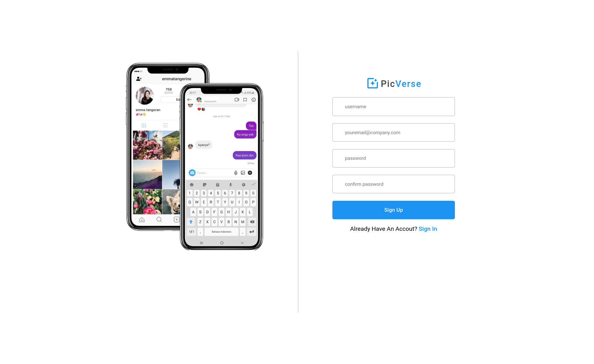

# Pic-Verse



### By: Samuel Martins

## Table of Content

- [Description](#description)
- [Installation Requirement](#usage)
- [Technology Used](#technologies)
- [Licence](#licence)
- [Authors Info](#author-info)

## Description

This project is an attemp to create a photo sharing social media platform. The features used for this project are similar to the ones on instagram platform. The future plans for this project includes adding more user stories than the ones I currently have. [live site]()

# Note:

This project is by no means complete. Therefore, don't be alarmed when you encounter bugs in any form. Development is ongoing

## Behaviour Driven Development

The user is able to;

- Sign in to the application to start using it

- Upload photos to the applicaion

- See their profile with all their pictures

- Follow other users and see their pictures on the user's timeline

- Like a picture and leave a comment on it

## Getting Started

These instructions will get you a copy of the project up and running on your local machine for development and testing purposes. See deployment for notes on how to deploy the project on a live system.

### Prerequisites

These are the things you need to install the software and how to install them

```
virtual enviroment:

$ pipenv shell

or

$ python3 -m venv virtual ( or your selected virtual enviroment name )
```

### 1. Local Repository

- Make sure you have a stable internet to have the ability to clone the repository.
- Type the following command in your terminal to clone this repository

```
git clone https://github.com/thesmartcoder7/pic-verse.git

```

If you are using SSH, use the following command

```
git clone git@github.com:thesmartcoder7/pic-verse.git
```

When you run the commands successfully, you should have a local version of this repository.

### 2. Online Repository

- Make sure you have a stable internet for forking this repository.
- According to the license, you can fork this project. You need to click on the forking icon and it will be added as one of your repositories

Feel free to fork the project and have fun with it. Happy coding!

### Installing

To get a development env running, you simply need the install all the packages reguired from either a requirements.txt file or a pipfile. First you need to activate your virtual environment

```
$pipenv shell

of

$ source virtualenvname/bin/activate
```

after that, install all the required depencencies

```
$ pipenv install //pretty much takes care of installing all depencies for you
```

Now that all your dependencies are installed, you need to create a local database for your project and run migrations, or use the database that django comes with by default. The Make file has instructions for this.

```
$ make migrate
```

After this, you can run the application using the commands that come in the make file. for this case, it is either of the following:

```
$ make

or

$ make run

or

$ python manage.py runserver

```

## Running the tests

If you want to run tests for the entire project, you need only run this command:

```
$ make test

or

$ python manage.py test
```

## Technologies

- HTML5
- SCSS
- JavaScript
- Django

## Licence

Copyright (c) Samuel Martins - [MIT Licence](LICENSE)

## Author Info

- Twitter - [@thesmartcoder7](https://twitter.com/thesmartcoder7)
- Linkedin - [Samuel Martins](https://www.linkedin.com/in/samuel-martins-09839b115/)
- Website - [Samuel Martins](https://smart-code.dev)
- blog - [Samuel Martins](https://samuel-martins.medium.com/)
